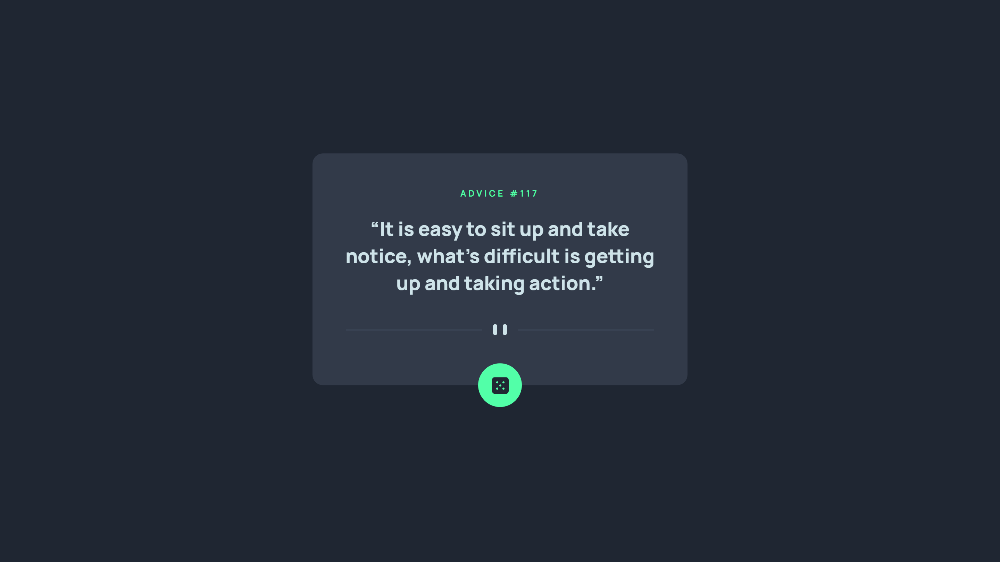
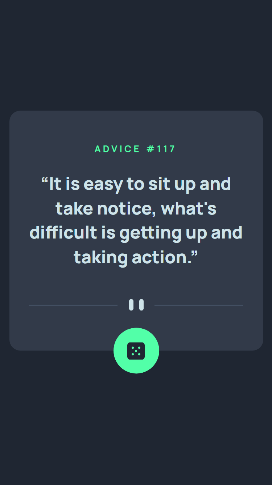

# Frontend Mentor - Advice generator app solution

This is a solution to the [Advice generator app challenge on Frontend Mentor](https://www.frontendmentor.io/challenges/advice-generator-app-QdUG-13db). Frontend Mentor challenges help you improve your coding skills by building realistic projects.

## Table of contents

- [Overview](#overview)
  - [The challenge](#the-challenge)
  - [Screenshot](#screenshot)
  - [Links](#links)
- [My process](#my-process)
  - [Built with](#built-with)

## Overview

### The challenge

### Screenshot

### Links

- Solution URL: [Solution](https://www.frontendmentor.io/solutions/advice-generator-app-sass-andand-fetch-api-OcWLWF8Dy)
- Live Site URL: [Live](https://cyruskabir.github.io/front-end-mentor/advice-generator-app)

## My process

### Built with
- Semantic HTML5 markup
- CSS custom properties
- Mobile-first workflow
- Sass V1.49.9 
