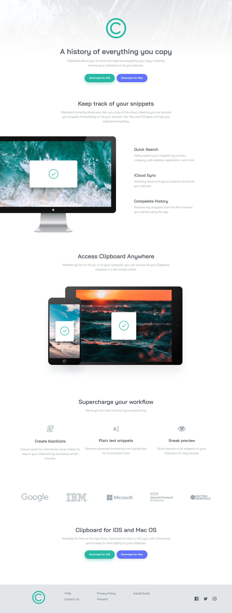

# Frontend Mentor - Clipboard landing page solution

This is a solution to the [Clipboard landing page challenge on Frontend Mentor](https://www.frontendmentor.io/challenges/clipboard-landing-page-5cc9bccd6c4c91111378ecb9). Frontend Mentor challenges help you improve your coding skills by building realistic projects. 

## Table of contents

- [Overview](#overview)
  - [The challenge](#the-challenge)
  - [Screenshot](#screenshot)
  - [Links](#links)
- [My process](#my-process)
  - [Built with](#built-with)
  - [What I learned](#what-i-learned)
  - [Useful resources](#useful-resources)

## Overview

### The challenge

Users should be able to:

- View the optimal layout for the site depending on their device's screen size
- See hover states for all interactive elements on the page

### Screenshot

### Links

- Solution URL: (https://www.frontendmentor.io/solutions/clipboardlandingpagewithtailwindcss-Q13Ru23mS)
- Live Site URL: (https://cyruskabir.github.io/Clipboard_landing_page_with_tailwindcss/)

## My process

### Built with

- Semantic HTML5 markup
- CSS custom properties
- Flexbox
- Mobile-first workflow
- [tailwindcss](https://v2.tailwindcss.com/) - v2.2.16

### What I learned
I learned how to understand technology and framework documents just by reading them very well and more easily, and there is no need to watch long and sometimes expensive training videos (of course, everyone has their own learning style), but in general The guard I had for this job fell very easily

### Useful resources

- [tailwind v2.2.16](https://v2.tailwindcss.com/)
- [install tailwind via npm](https://dev.to/slimpythonhow-to-install-tailwindcss-via-npm-all-steps-explained-2n5o) 
- [add custom font to tailwind (explained)](https://dev.to/thelamina/using-custom-fonts-in-tailwind-css-5doi)
