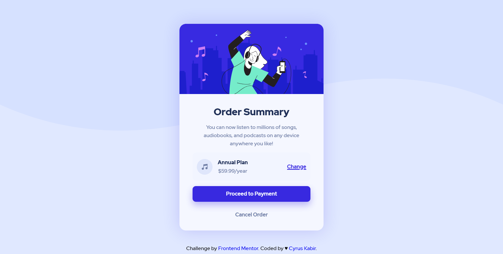

# Frontend Mentor - Order summary card solution

This is a solution to the [Order summary card challenge on Frontend Mentor](https://www.frontendmentor.io/challenges/order-summary-component-QlPmajDUj). Frontend Mentor challenges help you improve your coding skills by building realistic projects. 

## Table of contents

- [Overview](#overview)
  - [The challenge](#the-challenge)
  - [Screenshot](#screenshot)
  - [Links](#links)
- [My process](#my-process)
  - [Built with](#built-with)

**Note: Delete this note and update the table of contents based on what sections you keep.**

## Overview

### The challenge

Users should be able to:

.card__order-change-link:hover{
    color:rgba(56, 41, 224, 0.705);
    text-decoration: none;
}

.card__cta:hover{
    background-color: rgba(56, 41, 224, 0.705);
    transition:background-color .3s ease;
}

.card__cancel-link:hover{
    color:#1f2f56;
    transition: color .3s ease;
}
### Screenshot

### Built with

- Semantic HTML5 markup
- CSS custom properties
- Flexbox

