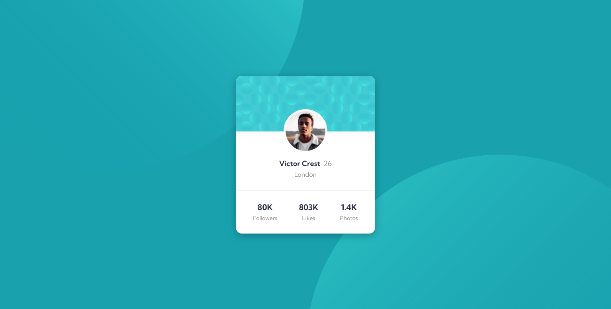

## Table of contents

- [Overview](#overview)
  - [The challenge](#the-challenge)
  - [Screenshot](#screenshot)
  - [Links](#links)
- [My process](#my-process)
  - [Built with](#built-with)

## Overview

### The challenge

- Build out the project to the designs provided

### Screenshot

### Links

- Solution URL: [Solution](https://www.frontendmentor.io/solutions/profilecardcomponentmain-easy-to-read-version-en7mB8bcr)
- Live Site URL: [Live](https://cyruskabir.github.io/front-end-mentor/profile-card)

## My process

### Built with

- Semantic HTML5 markup
- CSS custom properties
- Flexbox
